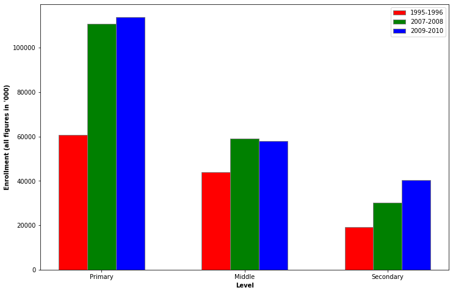
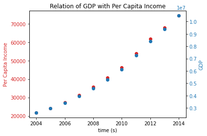
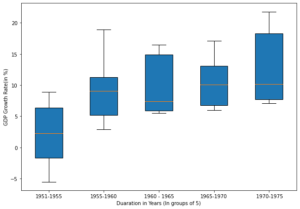

# DS200

## Plot 1(Bar Graph)
Data Source: https://data.gov.in/sites/default/files/datafile/enrolment02_1.xls

Plot showing Enrollment in various levels of Education in India. The trend show that enrollment at Primary and Middle level is significantly better then at Secondary Level. 

## Plot 2 (Scatter Plot)

Data Source: https://data.gov.in/sites/default/files/datafile/enrolment02_1.xls

Plot showing GDP and Per Capita Income across fiscal years. The linear relation between two plots shows that goverment was able to keep with increase in GDP with the increase in population.

## Plot 3 (Box Plot)

Data Source: https://data.gov.in/sites/default/files/datafile/enrolment02_1.xls

Plot showing the 5 year GDP growth rate statistics. This shows that Indian GDP has been on consistent growth after independence.

## Source Code

Source code is present in the file 

